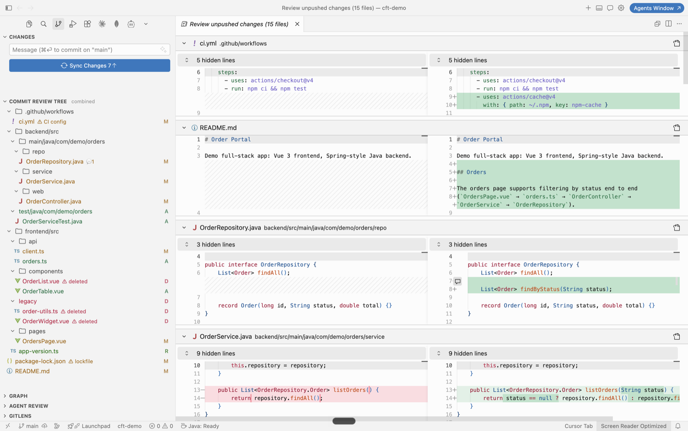
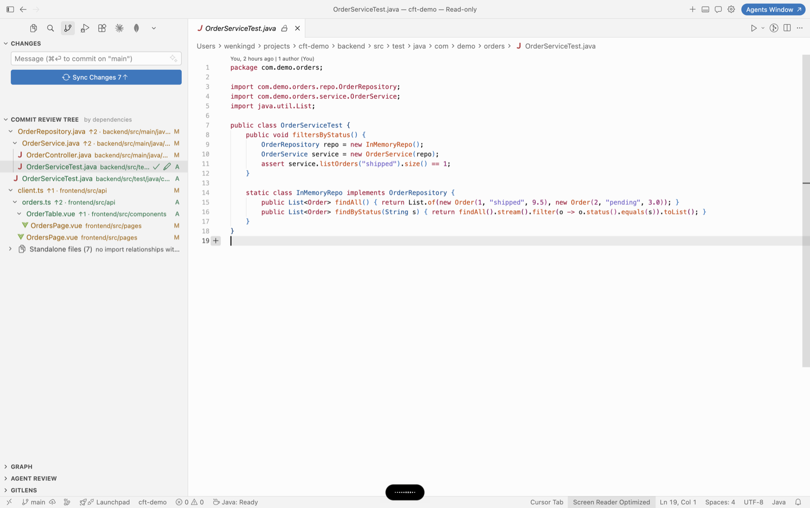
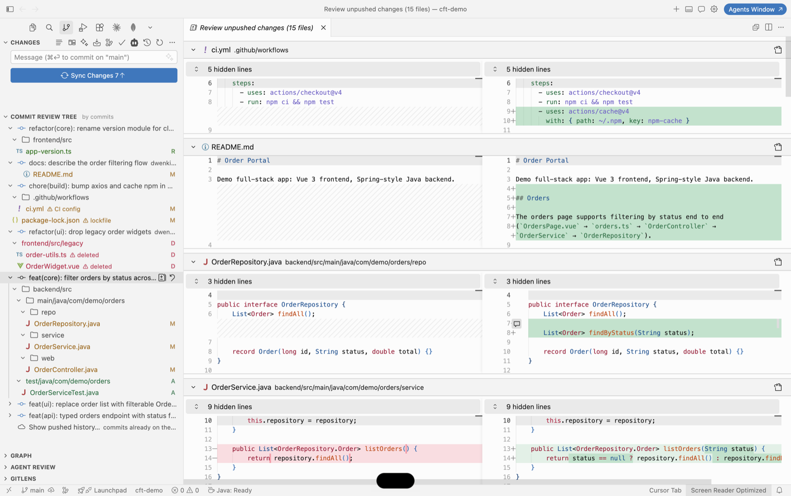
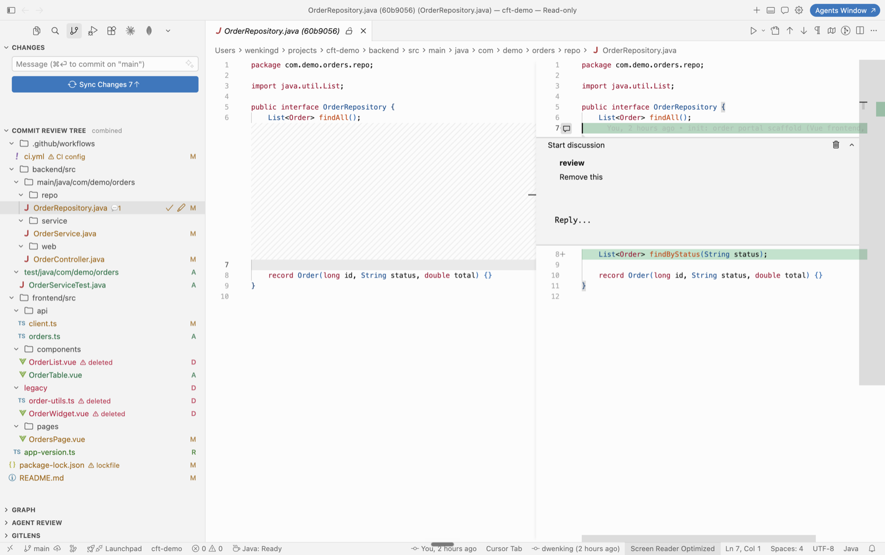
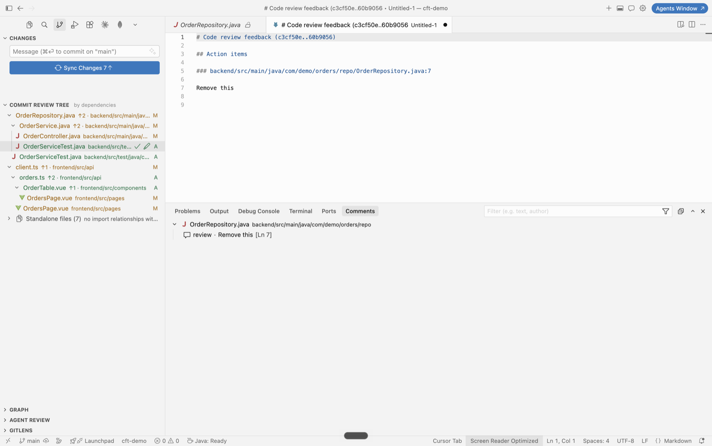

# Commit Review Tree

**Review AI-generated commits the way a human reviews a PR — without leaving Cursor/VS Code.**

When a coding agent works in your repo, it leaves behind a pile of local commits: intermediate fixes, broad file churn, and the occasional change you never asked for. This extension turns that pile into a reviewable unit — your unpushed work, presented as clear file trees with review tooling attached — so you can inspect, annotate, and feed the results straight back to the agent.

## Where to find it

After installing, open the **Source Control** sidebar (`Cmd/Ctrl+Shift+G`). The **COMMIT REVIEW TREE** section appears there, below the built-in Changes/Graph sections — it may start collapsed at the bottom, so click its header to expand, or drag the header upward to pin it where you like. Commit rows: click to expand the file tree, hover for the review-all and revert buttons, right-click for copy/revert actions.

## Features

### See what the agent actually did
- **Unpushed work first** — the list shows only local commits not yet on the remote (`@{upstream}..HEAD`), each with a `+adds −deletes` tag. Remote history stays out of the way behind "Show pushed history…".
- **Three view modes**, one click apart, with the active mode shown in the view header:
  - **By commits** — expand each commit into a real folder tree of its changes.
  - **Combined** — the *net* result of all unpushed commits as one tree. Ideal when the agent made ten intermediate commits and you only care about the final state.
  - **By dependencies** — changed files organized by who imports whom (`↑N` = imported by N changed files), so you review foundations before their callers. Files with no relationships are grouped under "Standalone files". Heuristic import analysis for JS/TS/Vue/Svelte, Python, Java/Kotlin/Scala, Go, Rust, C/C++, C#, Ruby, PHP.

- **Jump between modes per file** — spotted an interesting file in the commit or combined view? Right-click → **Reveal in Dependency View** switches modes, expands its import chain from the root, and selects it — instant answer to "what does this file sit on, and what sits on it?" without hunting through the tree.
- **Scope-drift risk flags** — the classic agent failure is touching things you didn't ask about. Deletions, lockfiles, CI config, env files, and build config are flagged with ⚠ and a reason.
- Native styling throughout: SCM status colors and badges, compact folders, blue dots for unpushed commits.

### Review it like a PR
- **Review all changes in one click** — the multi-diff button opens every changed file's diff stacked in a single tab, for the whole unpushed range or a single commit.

- **GitHub-style line comments** — click "+" in the diff gutter to comment on a line. Threads are keyed to the immutable commit, so they never drift, persist across reloads, and show as 💬 counts in the tree.

- **Reviewed checkmarks** — mark files done as you go; they dim with a ✓ so interrupted reviews resume exactly where you stopped.
- **File notes** — attach a whole-file remark (📝) when a line comment is too narrow.
- Renames, added, deleted files, and root commits all open correct diffs.

### Close the loop with the agent
- **Export review summary** — one click collects every line comment (with the quoted code), note, and flag into an action-item markdown report and copies it to the clipboard. Paste it into the agent chat as the fix list; it reads as instructions, not prose. Comments on files outside the change set ("this file should change too") are included in their own section — nothing you write is dropped.

- **Revert a commit** — right-click → revert (safe: creates an undo commit, after confirmation) when a change should simply not exist.
